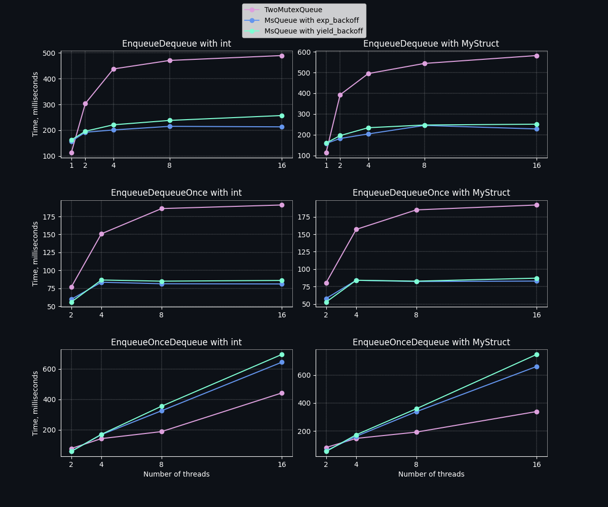

# <a href=https://t.me/fly_and_baphomet><strong></strong></a> MTDS C++ library

The Multi-Thread Data Structures (MTDS) library is header-only template library, a collection of the concurrent data structures. It contains the following implementations:
* Single-lock queue
* Lwo-lock queue
* Lock-free queue (Michael & Scott algorithm)
* Lock-free stack (Treiber algorithm)

### Prerequisites

* `g++` / `clang` / `msvc` compiler
* `CMake`
* `64`-bit architecture

### Compilation

`./compile.sh`

### Benchmarks

### References
* Lock-free queue & two-lock queue:
  * Michael, M.M.; Scott, M.L. (1996). [Simple, Fast, and Practical Non-Blocking and Blocking Concurrent Queue Algorithms](https://www.cs.rochester.edu/~scott/papers/1996_PODC_queues.pdf)
* Lock-free stack:
  * Treiber, R.K. (1986). [Systems programming: Coping with parallelism](https://dominoweb.draco.res.ibm.com/reports/rj5118.pdf)
